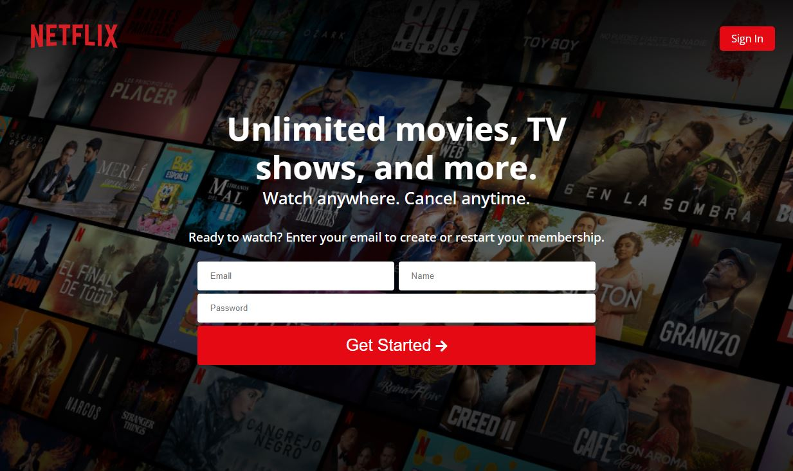
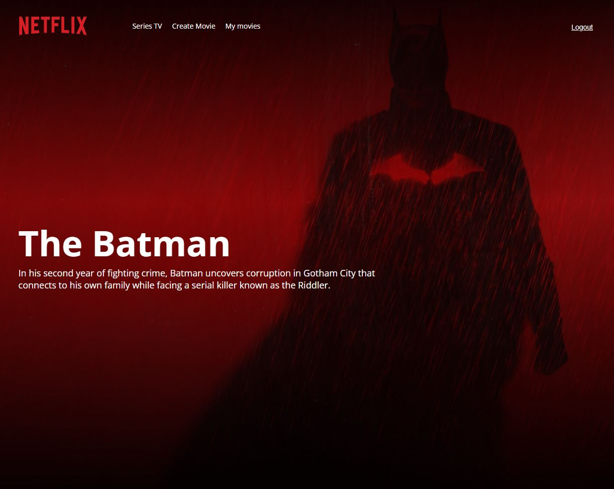
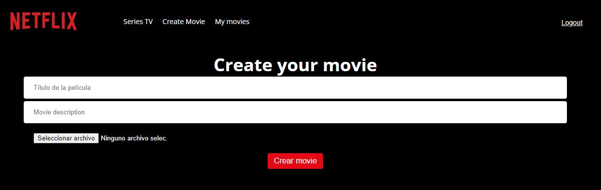
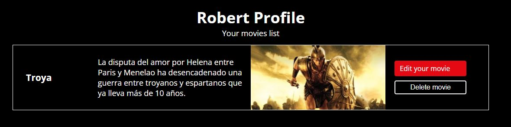

# Netflix React Clone

### Distant cousin of Netflix made with the MERN stack: MongoDB, ExpressJS, React and NodeJS.
This responsive app has a lot of features:

* Use of one API to get all the movies data.
* Authentication user with JSON Web Token.
* CRUD services to create, read, update and delete your own movies.
* Data base to save your movies.

  

